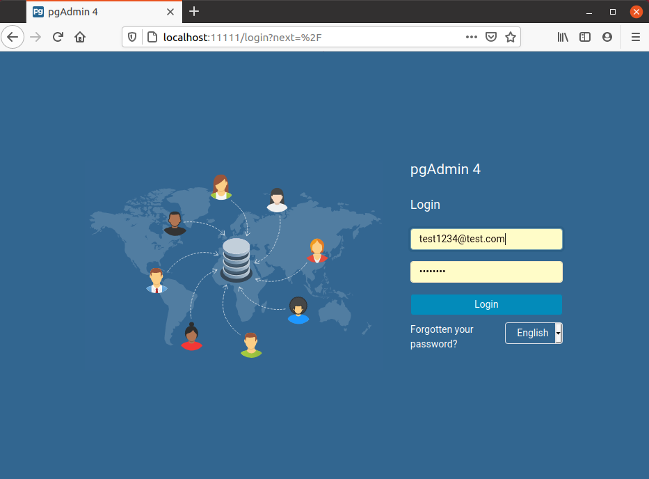
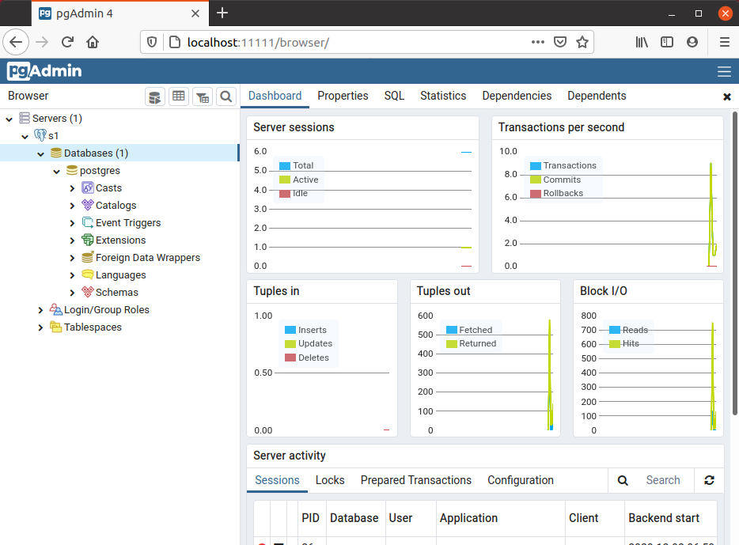

# Postgers 12 and pgadmin4


### Use-cases
- I'm a developer and need quckly postgres db with pgadmin


### Details
It's a docker-compose file containing next services:
```
$ docker-compose ps
              Name                             Command              State               Ports             
----------------------------------------------------------------------------------------------------------
dev-factory-postgres12_pgadmin_1    /entrypoint.sh                  Up      443/tcp, 0.0.0.0:11111->80/tcp
dev-factory-postgres12_postgres_1   docker-entrypoint.sh postgres   Up      0.0.0.0:5432->5432/tcp  
```


### Cridentials
All cridentials to pg and pgadmin are located here in .env file\
If you want to change cridentials - simply edit .env


### Updating /etc/hosts
Here is a tool which uses docker events for updating /etc/hosts.\
Prior to launching docker-compose do this:
```
$ sudo apt update && sudo apt install jq
$ sudo bash ./docker-hosts-update.sh
```
Once this script is run it will append/remove entiries into /etc/hosts


### To launch
```
$ docker-compose up -d --build
```
Ensure /etc/hosts contains records for all containers


### To shutdown
```
$ docker-compose down
```


### Web services
- [pgadmin](http://localhost:11111)\
    User: test1234@test.com\
    Password: test1234


### sevrers.json
servers.json is meant for importing/exporting db servers setup into pgadmin

To export servers.json
```
$ docker exec -it dev-factory-postgres12_pgadmin_1 python ./setup.py --dump-servers /tmp/servers.json --user test1234@test.com
$ docker exec -it dev-factory-postgres12_pgadmin_1 cat /tmp/servers.json
``` 

To import servers.json mount servres.json to /pgadmin4/servers.json


### Screenshots

#### Login page
<p align="center">
    
</p>
<br>


#### DB login
<p align="center">
    
</p>
<br>


#### DB view
<p align="center">
    
</p>
<br>

